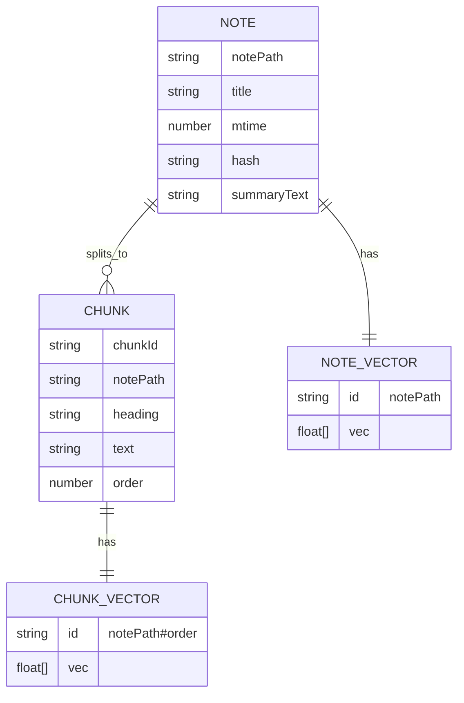
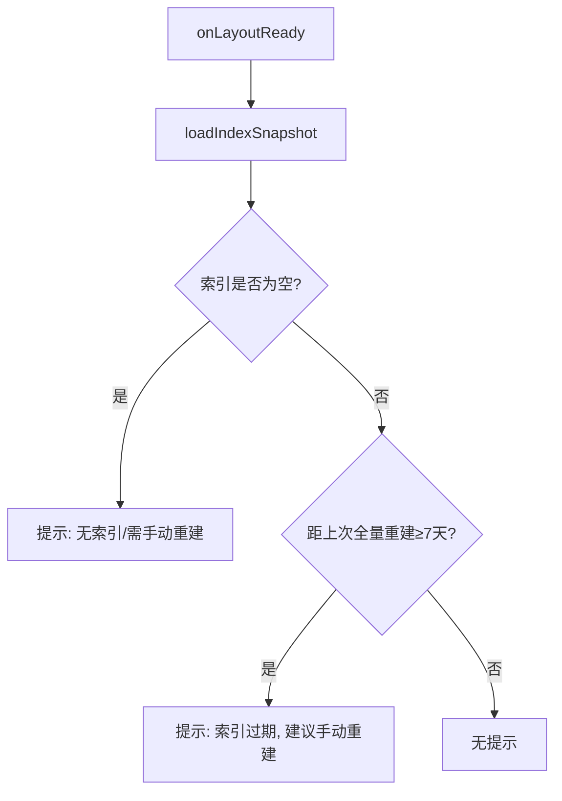
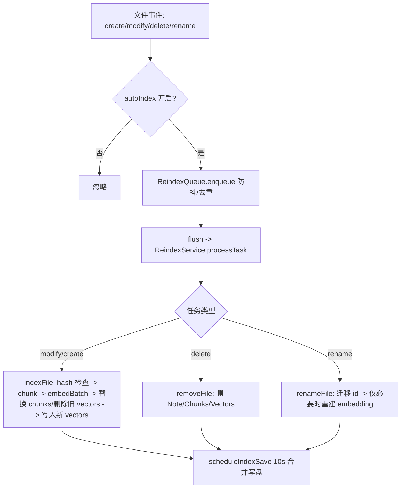
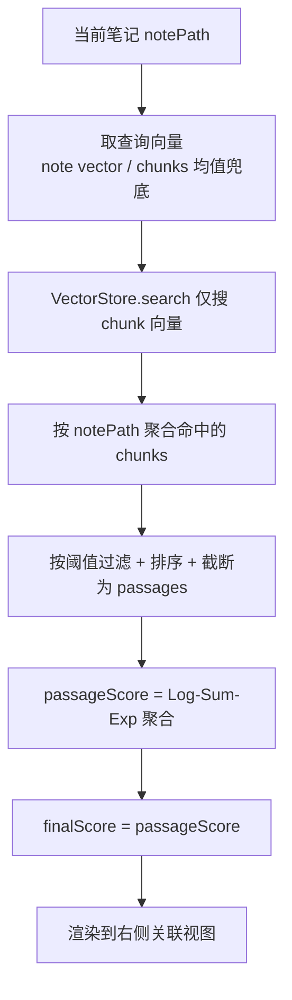

# 工作流与概念说明（中文）

> 面向当前仓库中的实现：`src/main.ts`、`src/indexing/*`、`src/search/*`、`src/views/*`。

## 1) 右侧「关联视图」怎么用？需要自己打开吗？

关联视图是一个独立的右侧侧栏视图（Connections View），用于展示“当前正在看的笔记”和“其他笔记”的语义关联结果。

打开方式有两种：

- **自动打开**：设置项 `启动时自动打开右侧关联视图`（`autoOpenConnectionsView`）为开时，插件在 `onLayoutReady()` 里创建右侧视图，但不会抢编辑器焦点。
- **手动打开**：通过命令面板执行 `打开关联视图`（command: `open-connections-view`）。

补充说明：

- 关联视图始终被放在 Obsidian **右侧侧栏**（插件会尽量避免把它打开到主编辑区）。
- 插件会保持 **只有一个** 关联视图叶子（leaf），避免重复打开导致的“多个关联视图同时存在”。
- 当关联视图本身成为 active leaf 时，`workspace.getActiveFile()` 可能返回 `null`，因此视图会回退到“主编辑区最近活动的 leaf”来确定当前笔记。

视图刷新时机（不涉及远程 embedding 调用）：

- 当前活动叶子（正在编辑/阅读的笔记）变化时刷新
- 当前笔记文件被修改时刷新（仅刷新 UI 结果；是否“变得更准”取决于索引是否最新）

> 注意：如果你开启了「增量索引」，文件修改会触发后台索引更新（可能产生远程 embeddings API 调用）；但“关联视图的查询/渲染”本身不调用 embedding。

## 2) 「索引」到底是什么？（索引图概念）

插件的“索引”由三份核心数据 + 一份快照组成：

- **NoteStore**：每篇笔记的元数据（title/mtime/hash/summaryText…）
- **ChunkStore**：每篇笔记切分后的语义块（chunk）元数据（heading/text/order…）
- **VectorStore**：向量存储（既存 note-level 向量，也存 chunk-level 向量）
- **Snapshot**：磁盘快照（`index-store.json` + `index-vectors.bin`）

快照加载时会做兼容性校验：若 embedding provider / baseUrl / model / 维度 / 切分策略 / note 向量策略不一致，则跳过加载并提示用户手动重建索引。

`VectorStore` 的 id 规则：

- **笔记向量（note-level）**：`id = notePath`（不含 `#`）
- **段落向量（chunk-level）**：`id = chunkId = ${notePath}#${order}`（包含 `#`）



## 3) 索引如何更新？（全量重建 vs 增量索引）

### 3.1 全量重建（手动）

- 触发方式：命令 `重建索引` 或设置页按钮 `重建`
- 行为：清空旧索引/错误日志 → 扫描所有笔记 → 切分 chunks → 批量生成 chunk embedding → 聚合 note 向量 → 写入 3 个 Store → 保存快照
- 成功后：更新 `lastFullRebuildAt`（用于启动时“7 天提醒”）
- 容错：全量索引按文件顺序执行；单文件失败会记录到错误日志并继续下一个文件（不会因为一个文件失败导致全量重建整体中断）

```mermaid
flowchart TD
  A[用户触发「重建索引」] --> B[清空旧索引（3 Stores）+ 清空错误日志]
  B --> C[Scanner 获取所有 Markdown 文件]
  C --> D{对每个文件}
  D --> E[读内容 + buildNoteMeta]
  E --> F[Chunker 切分为 chunks]
  F --> G[ReindexService 生成 embedding payloads]
  G --> H[EmbeddingService.embedBatch -> chunk vectors]
  H --> I[聚合 note vector = mean(chunk vectors)]
  I --> J[写入 NoteStore/ChunkStore/VectorStore]
  J --> D
  D --> K[保存 Snapshot: index-store.json + index-vectors.bin]
  K --> L[settings.lastFullRebuildAt = now]
```

### 3.2 启动时 7 天提醒（不自动重建）

插件启动不会自动全量重建；只会在满足条件时提醒：

- 若 `lastFullRebuildAt` 距今 ≥ 7 天 → 弹出 Notice 提醒用户手动重建



### 3.3 增量索引（可选开关，默认关闭）

增量索引的意义：当你频繁编辑/新增笔记时，只更新“变动的那几篇”，避免每次都全量重建。

当设置项 `增量索引（监听文件变更）`（`autoIndex`）开启后：

- 监听 create/modify/delete/rename
- 进入 `ReindexQueue` 防抖去重（默认 1000ms）
- 执行 `ReindexService.processTask()`
  - modify/create：会做 hash 对比，内容没变就跳过
    - 内容有变时，会先生成新向量；生成成功后再替换 ChunkStore，并删除该文件旧的 note/chunk 向量，避免旧索引残留
  - delete：级联删除该笔记相关 chunks/vectors
  - rename：先迁移各 Store 的 key/id；若内容未变，仅更新 NoteStore 元数据；若内容有变，才会走完整 `indexFile` 流程重新计算 embedding
- 之后会延迟合并写盘（`scheduleIndexSave()`，10 秒聚合保存一次）



## 4) 「关联视图」到底在匹配什么？（笔记 vs 段落）

当前实现采用“**chunk 召回 + 按笔记聚合**”的方式，核心目标是避免“大笔记的 note-level 向量被均值化后语义稀释”，导致关联召回失败。

1. **chunk 召回（chunk-level recall）**：用“当前笔记的查询向量”（优先使用持久化的 note-level 向量；缺失时用当前 chunks 的均值兜底），在全量 **chunk-level 向量** 中检索 topK。
2. **按笔记聚合**：将命中的 chunks 按 `notePath` 归类（同一篇笔记可以命中多个 chunks）。
3. **聚合评分（Log-Sum-Exp）**：对每篇候选笔记的 passage 分数做 log-sum-exp 聚合得到 `passageScore`，并用它作为最终排序的 `finalScore`。

分数说明（越大越相关）：

- `noteScore`：该候选笔记的 **最佳命中 chunk 分数**（用于 UI 展示）
- `passageScore`：该候选笔记命中 chunks 的 **聚合分数**（log-sum-exp）
- `finalScore = passageScore`

这意味着你在 UI 上看到的是：

- **一个当前笔记 → 多个候选笔记**
- **每个候选笔记 → 0..N 个最相关段落（来自候选笔记）**



## 5) 什么是「语义搜索」？项目里落地到哪里了？

语义搜索（Lookup）= “输入一句自然语言” → 返回“最相关的笔记 + 最相关的段落预览”。

项目落地：

- 视图：`打开语义搜索`（command: `open-lookup-view`）
- 实现：`LookupService.search(query, maxResults)`
  - 先对 query 做一次 embedding（**会调用远程 embeddings API**）
  - 再在所有 **chunk-level 向量** 中检索 topK
  - 按笔记聚合：每篇笔记只保留分数最高的 chunk
  - 返回结果列表（每条包含该笔记的最佳段落）

```mermaid
flowchart TD
  A[用户输入 query] --> B[EmbeddingService.embed(query)]
  B --> C[VectorStore.search 仅搜 chunk 向量]
  C --> D[按 notePath 聚合: 每篇笔记保留最佳 chunk]
  D --> E[取 NoteStore/ChunkStore 元数据]
  E --> F[渲染到「语义搜索」视图]
```

示例（直观理解）：

- 你搜：“启动时不要自动重建索引”
- 即使笔记里写的是“启动仅提示，手动全量重建”，也可能被召回，因为向量表达的是语义接近而不是关键词完全一致。

## 6) 切分方式 API 支持吗？

当前远程 provider 使用 OpenAI-compatible `/v1/embeddings`：

- 请求体 `input` 是字符串数组（批量）
- 插件会把每个 chunk 的 embedding payload（`heading + text`）控制在 1200 字符内，并在索引阶段再次验证/必要时二次切分（heading 上下文会先截断到 200 字符，避免超长标题主导 embedding）

因此“切分方式是否能被 API 接收”的关键点是：每条 `input` 不要过长、不要为空、批量大小合理；这些在当前实现里都有保护。
